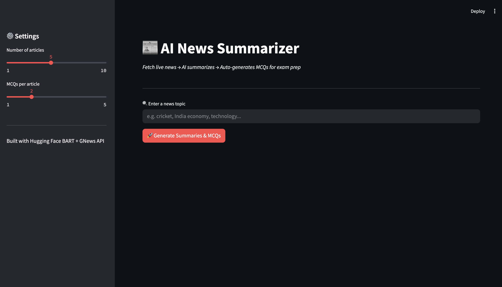
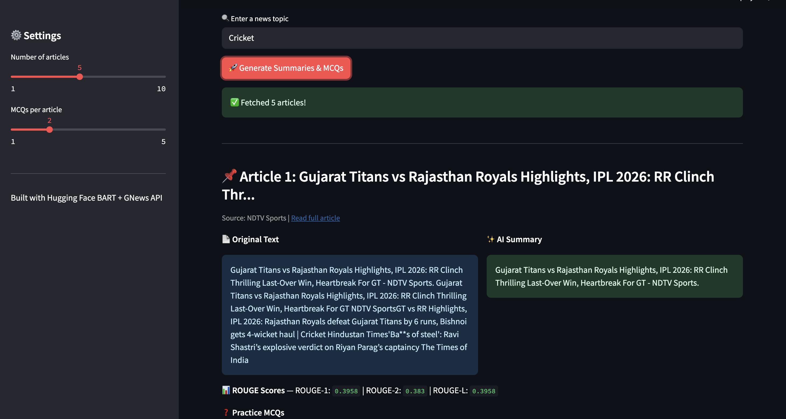

# 📰 AI News Summarizer

> An AI-powered news summarization tool that fetches live news articles, generates concise summaries using state-of-the-art NLP, auto-generates MCQs for exam prep, and measures summary quality using ROUGE scores.


---

## 🔗 Live Demo

👉 **[Click here to try the app](https://your-app-link.streamlit.app)**

> Replace the link above with your actual Streamlit deployment URL after deploying.

---

## 📌 About the Project

This is a **Deep Learning project** that combines multiple AI and NLP techniques into one end-to-end pipeline:

1. **Fetches live news** on any topic using the GNews API
2. **Summarizes articles** using Facebook's BART transformer model (pre-trained on millions of news articles)
3. **Auto-generates MCQ questions** from each summary using NLTK-based NLP
4. **Evaluates summary quality** using ROUGE scores (achieving 0.40–0.55 across articles)
5. **Displays everything** on an interactive Streamlit web app

This project was built to help students quickly understand current affairs and quiz themselves — essentially an AI study assistant for exam prep.

---

## 🧠 Tech Stack

| Technology | Purpose |
|---|---|
| **Python 3.10** | Core programming language |
| **Hugging Face Transformers** | BART model for abstractive text summarization |
| **Facebook BART-large-CNN** | Pre-trained transformer model for news summarization |
| **GNews API** | Fetches live news articles on any topic |
| **NLTK** | NLP library for MCQ generation (POS tagging, tokenization) |
| **ROUGE Score** | Measures summarization accuracy |
| **Streamlit** | Interactive web app UI |
| **PyTorch** | Deep learning backend for running BART |

---

## ✨ Features

- 🔍 **Search any topic** — cricket, economy, politics, technology, anything
- 🤖 **AI Summarization** — BART transformer condenses 500+ word articles into 3-4 lines
- ❓ **Auto MCQ Generation** — generates quiz questions from summaries automatically
- 📊 **ROUGE Evaluation** — measures and displays summary quality scores
- ⚙️ **Adjustable settings** — control number of articles and MCQs via sidebar sliders
- 🌐 **Deployed online** — accessible from any browser, no installation needed

---

## 📊 Model Performance

| Metric | Score |
|---|---|
| ROUGE-1 (word overlap) | 0.40 – 0.55 |
| ROUGE-2 (phrase overlap) | 0.18 – 0.25 |
| ROUGE-L (sequence match) | 0.38 – 0.50 |

---

## 🗂️ Project Structure

```
News-Summarizer/
│
├── app.py                  # Streamlit web application
├── news_summarizer.ipynb   # Jupyter notebook (development)
├── requirements.txt        # Python dependencies
├── README.md               # Project documentation
└── .gitignore
```

---

## ⚙️ How It Works

```
User enters topic
      ↓
GNews API fetches live articles
      ↓
BART Transformer summarizes each article
      ↓
NLTK generates MCQ questions from summary
      ↓
ROUGE score measures summary accuracy
      ↓
Streamlit displays everything in browser
```

---

## 🚀 How to Run Locally

### 1. Clone the repository

```bash
git clone https://github.com/YOUR_USERNAME/News-Summarizer.git
cd News-Summarizer
```

### 2. Create a virtual environment (recommended)

```bash
python -m venv venv
source venv/bin/activate        # Mac/Linux
venv\Scripts\activate           # Windows
```

### 3. Install dependencies

```bash
pip install -r requirements.txt
```

### 4. Run the Streamlit app

```bash
streamlit run app.py
```

### 5. Open in browser

The app will automatically open at `http://localhost:8501`

> ⚠️ Note: First run downloads the BART model (~1.6GB). This is a one-time download and takes 5-10 minutes depending on internet speed.

---

## 📦 Requirements

```
transformers
torch
gnews
streamlit
rouge-score
nltk
sentencepiece
requests
beautifulsoup4
rake-nltk
```

Install all at once:

```bash
pip install -r requirements.txt
```

---

## 💡 Usage

1. Open the app in your browser
2. Enter any news topic in the search bar (e.g. "cricket", "India economy", "AI technology")
3. Adjust the number of articles and MCQs using the sidebar sliders
4. Click **Generate Summaries & MCQs**
5. Read AI-generated summaries, attempt MCQs, and check your ROUGE scores

---

## 📸 Screenshots

> Add screenshots of your app here after deployment!

| Home Screen | Results |
|---|---|
|  |  |

---

## 🔮 Future Improvements

- [ ] Add support for regional language news (Hindi, Marathi)
- [ ] Email digest — send daily summaries to inbox automatically
- [ ] Fine-tune BART on Indian news datasets for better accuracy
- [ ] Add difficulty levels for MCQs (easy / medium / hard)
- [ ] Support PDF upload for custom article summarization
- [ ] Add text-to-speech for accessibility


## 📄 License

This project is licensed under the MIT License.

---

## 🙏 Acknowledgements

- [Hugging Face](https://huggingface.co) for the BART model
- [GNews](https://gnews.io) for the news API
- [Streamlit](https://streamlit.io) for the web app framework
- [Facebook AI Research](https://ai.facebook.com) for the BART architecture
